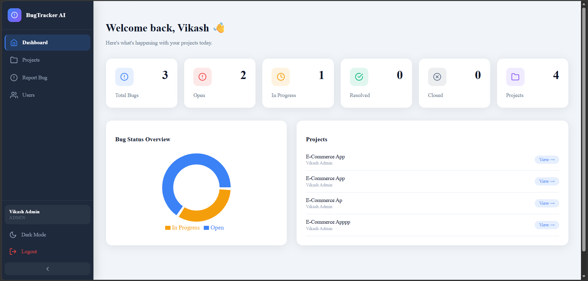
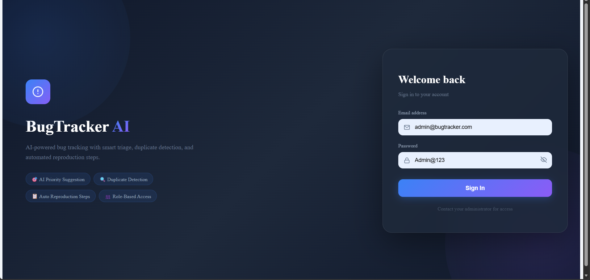
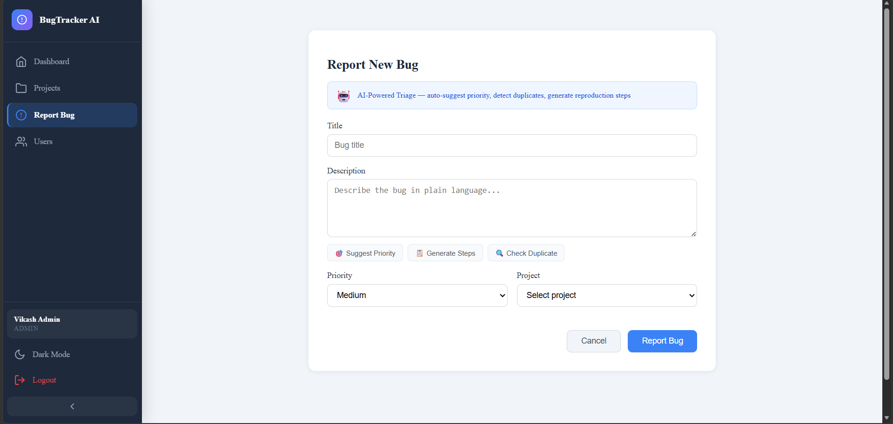
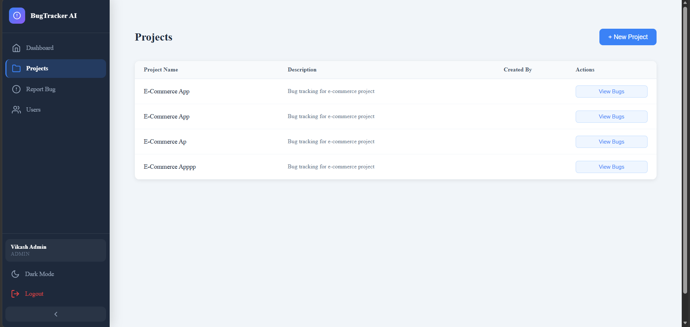
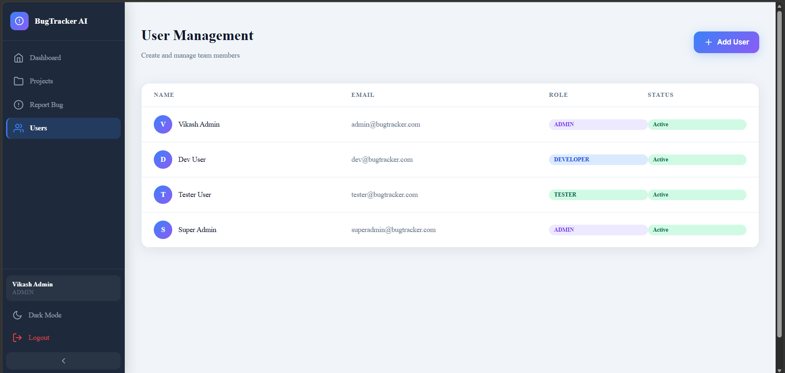

# 🐛 BugTracker AI — Full Stack SaaS

> **AI-powered bug tracking with smart triage, duplicate detection, and automated reproduction steps.**  
> Built with Java · Spring Boot · MySQL · React · JWT · Spring Security · OpenAI API



---

## 🚀 Live Demo

🔗 **[View Live App](https://your-live-url.com)**  
👤 **Demo Credentials:**  
- Admin: `admin@bugtracker.com` / `Admin@123`  
- Developer: `dev@bugtracker.com` / `Dev@123`  
- Tester: `tester@bugtracker.com` / `Tester@123`

---

## ✨ Key Features

### 🤖 AI-Powered Triage
- **Auto-suggests bug severity** from plain language descriptions — no manual classification needed
- **Detects duplicate bugs** using semantic similarity before submission
- **Generates developer-ready reproduction steps** automatically from bug descriptions

### 🔐 Role-Based Access Control (RBAC)
| Role | Permissions |
|------|------------|
| **Admin** | Full access — manage users, projects, all bugs |
| **Developer** | View assigned bugs, update status, add comments |
| **Tester** | Report bugs, view project bugs |

### 📊 Dashboard & Analytics
- Real-time bug status overview with visual charts
- Project-level bug tracking (Open, In Progress, Resolved, Closed)
- Activity logs for full audit trail

### ⚙️ Production-Grade Backend
- **Controller–Service–Repository + DTO** architecture pattern
- **@Transactional** on service layer to prevent lazy loading issues
- **CORS** configured inside Spring Security 7 filter chain
- **JWT** authentication with Spring Security 7
- **Pagination & filtering** across all bug lists

---

## 🛠️ Tech Stack

| Layer | Technology |
|-------|-----------|
| **Backend** | Java, Spring Boot, Spring Security 7, JWT |
| **Frontend** | React.js, Redux, Tailwind CSS |
| **Database** | MySQL |
| **AI** | OpenAI API (GPT-4) |
| **Auth** | JWT + Spring Security |
| **Deploy** | Render (backend) · Netlify (frontend) |

---

## 📸 Screenshots

| Login | Dashboard |
|-------|-----------|
|  |  |

| Report Bug (AI Triage) | Projects |
|------------------------|----------|
|  |  |

| User Management |
|----------------|
|  |

---

## 🏗️ Architecture

```
├── Backend (Spring Boot)
│   ├── Controller Layer       → REST API endpoints
│   ├── Service Layer          → Business logic + @Transactional
│   ├── Repository Layer       → JPA/MySQL data access
│   ├── DTO Pattern            → Clean request/response mapping
│   └── Security Config        → JWT + CORS + Spring Security 7
│
└── Frontend (React)
    ├── Redux Store            → Global state management
    ├── Role-based routing     → Admin / Developer / Tester views
    └── OpenAI integration     → AI triage UI (suggest, duplicate, steps)
```

---

## ⚡ Getting Started

### Prerequisites
- Java 17+
- Node.js 18+
- MySQL 8+
- OpenAI API key

### Backend Setup
```bash
git clone https://github.com/yourusername/bugtracker-ai
cd bugtracker-ai/backend

# Configure application.properties
cp src/main/resources/application.example.properties src/main/resources/application.properties
# Add your MySQL credentials and OpenAI API key

mvn spring-boot:run
```

### Frontend Setup
```bash
cd ../frontend
npm install

# Configure environment
cp .env.example .env
# Add your backend URL

npm run dev
```

### Database
```bash
# MySQL — create database
CREATE DATABASE bugtracker;
# Tables are auto-created via Spring JPA on first run
```

---

## 📁 Project Structure

```
bugtracker-ai/
├── backend/
│   ├── src/main/java/com/bugtracker/
│   │   ├── controller/        # REST controllers
│   │   ├── service/           # Business logic
│   │   ├── repository/        # JPA repositories
│   │   ├── dto/               # Data transfer objects
│   │   ├── model/             # Entity classes
│   │   └── security/          # JWT + Spring Security config
│   └── pom.xml
└── frontend/
    ├── src/
    │   ├── components/        # Reusable UI components
    │   ├── pages/             # Route-level pages
    │   ├── store/             # Redux slices
    │   └── api/               # API service layer
    └── package.json
```

---

## 🔑 API Endpoints (Sample)

```
POST   /api/auth/login              → JWT login
GET    /api/bugs?page=0&size=10     → Paginated bug list
POST   /api/bugs                    → Report new bug
PUT    /api/bugs/{id}/status        → Update bug status
POST   /api/ai/suggest-priority     → AI severity suggestion
POST   /api/ai/check-duplicate      → AI duplicate detection
POST   /api/ai/generate-steps       → AI reproduction steps
GET    /api/projects                → List all projects
GET    /api/users                   → List all users (Admin only)
```

---

## 👨‍💻 Author

**Vikash Gautam** — Full Stack Developer  
📧 gautam7.ven@gmail.com  
🔗 [LinkedIn](https://linkedin.com/in/yourprofile) · [Portfolio](https://yourportfolio.com) · [GitHub](https://github.com/yourusername)

---

## 📄 License

MIT License — feel free to use this as a reference or template.
